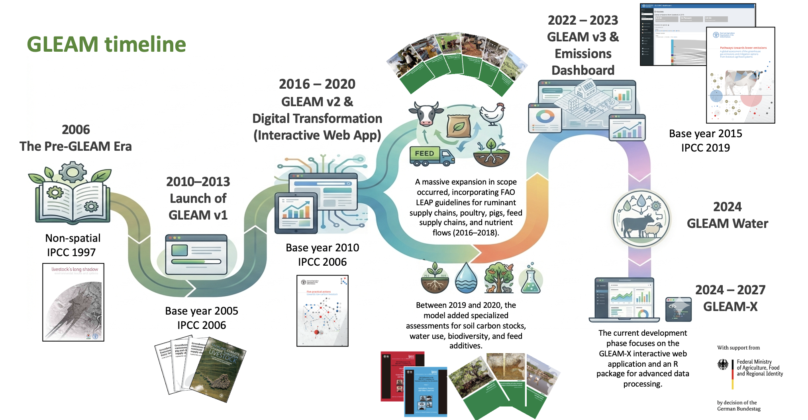

# History of GLEAM

GLEAM builds on nearly two decades of FAO work on assessing the environmental
impacts of livestock systems at global scale. Key milestones include:

- **2006**: Pre-GLEAM era of non-spatial global assessments.
- **2010–2013**: Launch of GLEAM v1 with spatially explicit LCA using
  2005 reference-year data.
- **2017**: Release of GLEAM v2 and the GLEAM-i interactive web tool.
- **2023**: Release of GLEAM v3 with 2015 reference-year data, based on the
  2019 IPCC Refinement, and the GLEAM Dashboard.
- **2024**: GLEAM-Water. The first global assessment of water use in livestock agri-food systems
- **2024–present**: GLEAM-X initiative delivering an open-source R package and interactive web application.

```{r, echo=FALSE, eval = TRUE, out.width="100%", fig.cap="The history of the GLEAM model with different versions and major releases"}

```

