```{r setup, include = FALSE}
knitr::opts_chunk$set(
  collapse = TRUE,
  comment  = "#>",
  eval     = FALSE
)
```

# Introduction

This vignette provides a high-level overview of all GLEAM modules, the sequence
of their functions, and their input and output datasets. An overview of the full
pipeline is provided in the [GLEAM Overview](gleam-overview.html). Full
documentation for each module is available via the module reference pages linked
in each section below.

# Herd Simulation Module

*See [`run_demographic_herd_module()`](../reference/run_demographic_herd_module.html) for full documentation.*

This module takes herd- and cohort-level demographic inputs and estimates a
steady-state sex–age herd structure compatible with downstream calculations in
GLEAM. In addition to cohort population sizes, it derives population growth
rates and offtake numbers. The steady state is defined as a constant sex–age
cohort structure over time, with population size potentially growing or
declining at a constant rate.

The module operates under a **steady-state assumption**: demographic parameters
are constant over time, so the population converges to a stable cohort
composition and a constant annual growth rate. Once this regime is reached, the
model computes cohort population sizes (start/end/average), cohort shares, and
offtake totals.

A key feature of this implementation is that it applies demography at a
**daily** resolution. Annual mortality and offtake inputs are converted into
daily hazards and daily transition probabilities under competing risks (death
vs. offtake vs. survival). Conceptually, this corresponds to the steady-state
demographic approach implemented in Dynmod *STEADY1* (Lesnoff, 2013), adapted
here to a daily time-step formulation.

The population is divided by sex (female/male) and age class
(juvenile/subadult/adult), represented by six cohorts: `FJ`, `FS`, `FA`
(female juvenile, subadult, adult) and `MJ`, `MS`, `MA` (male juvenile,
subadult, adult).

<details open>
<summary><strong>Overview of the GLEAM demographic herd module with functions, input and output:</strong></summary>

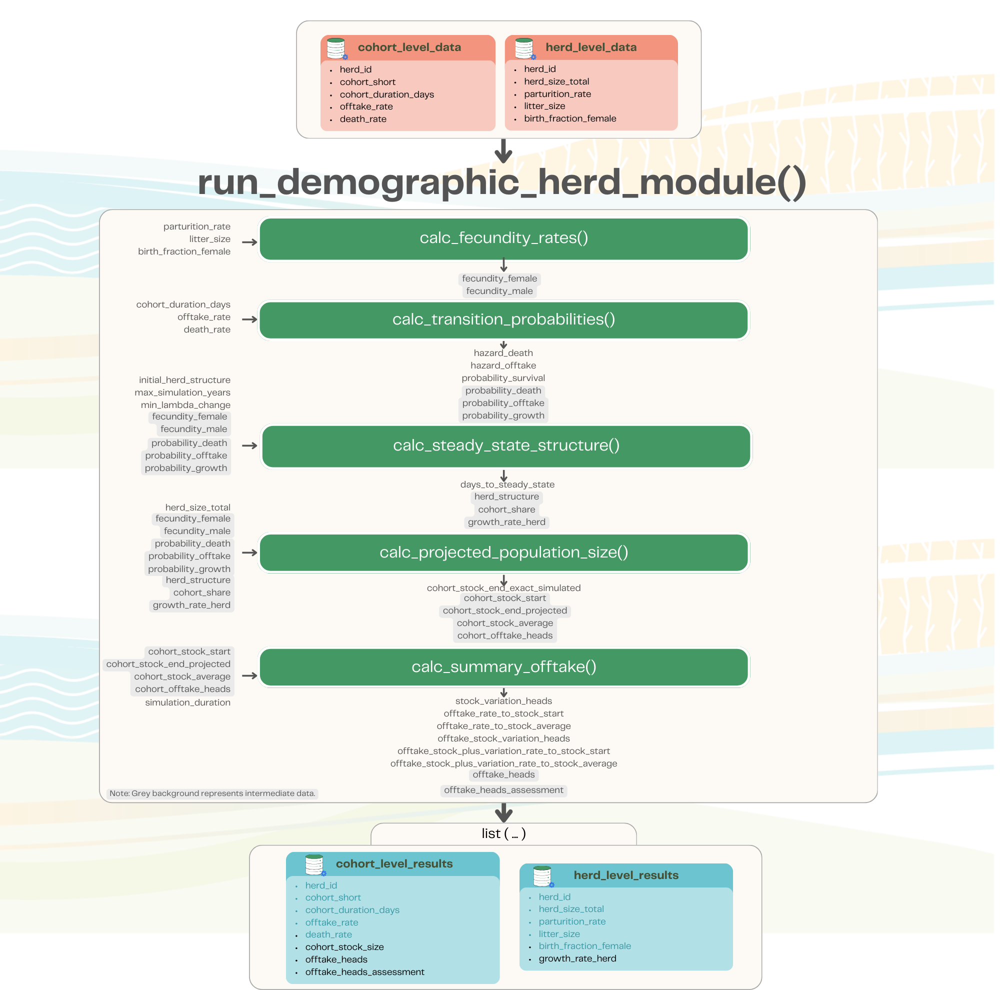
<div class="module-figure-hint"></div>

</details>

# Weights Module

*See [`run_weights_module()`](../reference/run_weights_module.html) for full documentation.*

Computes cohort-level live weight metrics by combining cohort-level inputs with
herd-level biological parameters. The module appends cohort weights (initial,
potential final, slaughter), then derives average and final live weights
accounting for offtake, and finally computes average daily live weight gain
over each cohort stage.

<details open>
<summary><strong>Overview of the GLEAM weights module with functions, input and output:</strong></summary>

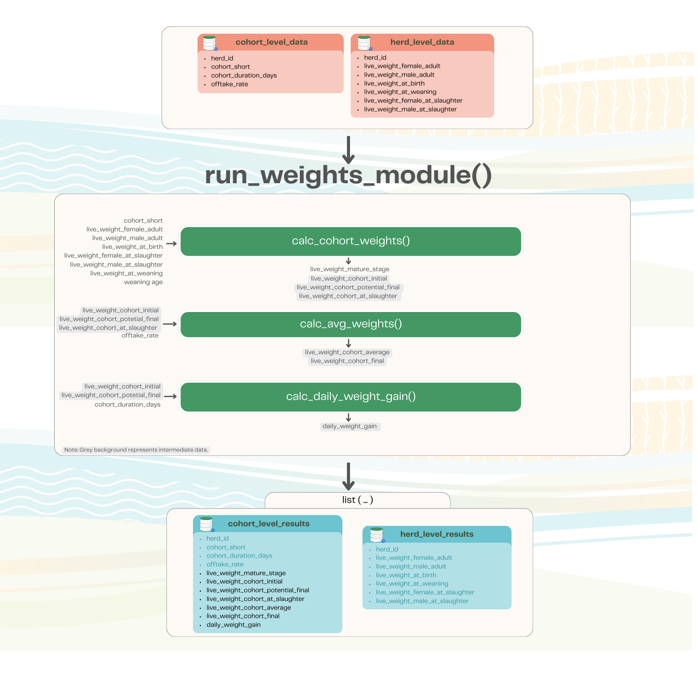
<div class="module-figure-hint"></div>

</details>

The calculation pipeline consists of the following steps:

1. **Cohort-stage weight assignment** — herd-level biological parameters are
   matched to each cohort row by `herd_id` and weights are assigned per life
   stage using [`calc_cohort_weights()`](../reference/calc_cohort_weights.html).
2. **Average and final live weights (accounting for offtake)** — computed using
    [`calc_avg_weights()`](../reference/calc_avg_weights.html).
3.  **Average daily live weight gain** — computed using
    [`calc_daily_weight_gain()`](../reference/calc_daily_weight_gain.html).


# Ration Nutritional Content Module

*See [`run_ration_quality_module()`](../reference/run_ration_quality_module.html) for full documentation.*

Computes cohort-level diet nutritional metrics — gross and metabolizable energy
content, digestibility, nitrogen content, urinary energy losses, and ash
content — from cohort-level feed ration composition shares and feed component
nutrient parameters.

<details open>
<summary><strong>Overview of the GLEAM herd module with functions, input and output:</strong></summary>

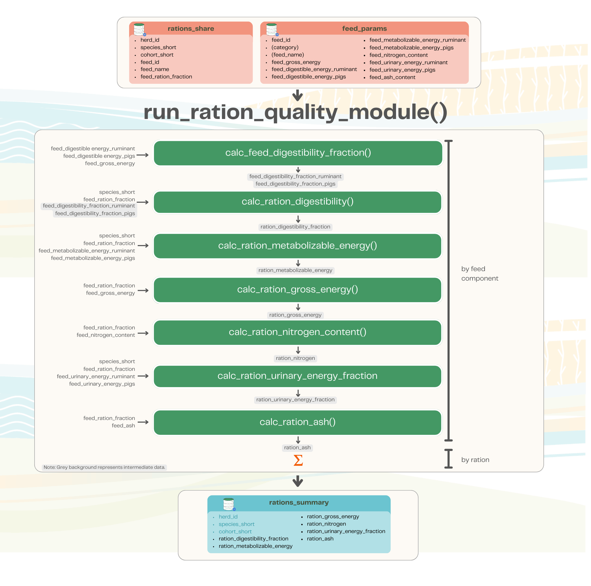
<div class="module-figure-hint"></div>

</details>

The module joins ration shares with feed parameters by `feed_id`, uses
`species_short` for species-specific lookups, and computes ration-weighted
nutritional metrics by cohort through the following steps:

1. Species-specific digestibility fractions are computed from energy parameters
   using [`calc_feed_digestibility_fraction()`](../reference/calc_feed_digestibility_fraction.html).
2. Contributions of each feed component are computed as ration-weighted values for:
   - gross energy — [`calc_ration_gross_energy()`](../reference/calc_ration_gross_energy.html)
   - nitrogen — [`calc_ration_nitrogen_content()`](../reference/calc_ration_nitrogen_content.html)
   - digestibility — [`calc_ration_digestibility()`](../reference/calc_ration_digestibility.html)
   - metabolizable energy — [`calc_ration_metabolizable_energy()`](../reference/calc_ration_metabolizable_energy.html)
   - urinary energy fraction — [`calc_ration_urinary_energy_fraction()`](../reference/calc_ration_urinary_energy_fraction.html)
    -   ash — [`calc_ration_ash()`](../reference/calc_ration_ash.html)
3. Component contributions are summed to produce cohort-level diet metrics,
   including [`calc_ration_intake()`](../reference/calc_ration_intake.html).


# Metabolic Energy Requirements and Ration Intake Module

*See [`run_metabolic_energy_req_module()`](../reference/run_metabolic_energy_req_module.html) for full documentation.*

Computes cohort-level daily energy requirements (MJ/head/day) and feed dry
matter intake (kg DM/head/day) by applying the IPCC Tier 2 energy partitioning
functions.

Energy requirements are expressed as **net energy (NE)** for CTL, BFL, SHP,
and GTS, and as **metabolizable energy (ME)** for CML, PGS, and CHK. The
module computes the following energy partitions:

- Maintenance — [`calc_metabolic_energy_req_maintenance()`](../reference/calc_metabolic_energy_req_maintenance.html)
- Activity — [`calc_metabolic_energy_req_activity()`](../reference/calc_metabolic_energy_req_activity.html)
- Growth — [`calc_metabolic_energy_req_growth()`](../reference/calc_metabolic_energy_req_growth.html)
- Lactation — [`calc_metabolic_energy_req_lactation()`](../reference/calc_metabolic_energy_req_lactation.html)
- Pregnancy — [`calc_metabolic_energy_req_pregnancy()`](../reference/calc_metabolic_energy_req_pregnancy.html)
- Work (draught power; CTL, BFL, CML only) — [`calc_metabolic_energy_req_work()`](../reference/calc_metabolic_energy_req_work.html)
- Fibre production (SHP, GTS, CML only) — [`calc_metabolic_energy_req_fibre()`](../reference/calc_metabolic_energy_req_fibre.html)

Total energy requirements are then aggregated using
[`calc_total_metabolic_energy_req()`](../reference/calc_total_metabolic_energy_req.html),
and dry matter intake is derived using
[`calc_ration_intake()`](../reference/calc_ration_intake.html) by dividing the
total energy requirement by the diet energy density.

<details open>
<summary><strong>Overview of the GLEAM metabolic energy requirements module with functions, input and output:</strong></summary>

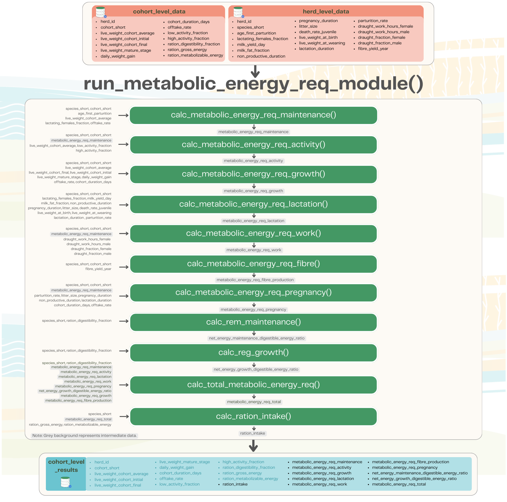
<div class="module-figure-hint"></div>

# Enteric Emissions Module
</details>


*See [`run_emissions_enteric_module()`](../reference/run_emissions_enteric_module.html) for full documentation.*

Computes daily enteric methane emissions by cohort (kg CH₄/head/day) using the
IPCC Tier 2 approach, by applying species-, cohort-, and diet-specific methane
conversion factors (ym).
<details open>
<summary><strong>Overview of the GLEAM enteric emissions module with functions, input and output:</strong></summary>

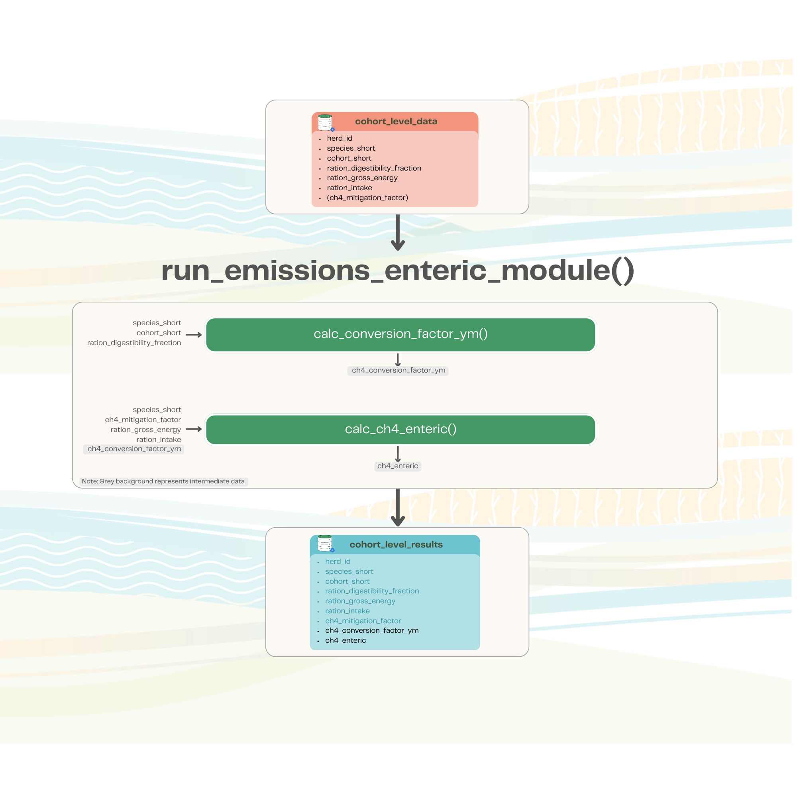
<div class="module-figure-hint"></div>

</details>

The calculation pipeline consists of the following steps:

1. If `ch4_mitigation_factor` is not provided in the input data, it is set to
   `1` (no mitigation).
2.  The methane conversion factor (ym) is computed using
    [`calc_conversion_factor_ym()`](../reference/calc_conversion_factor_ym.html).
3.  Daily enteric methane emissions are computed using
    [`calc_ch4_enteric()`](../reference/calc_ch4_enteric.html).


# Nitrogen Balance Module

*See [`run_nitrogen_balance_module()`](../reference/run_nitrogen_balance_module.html) for full documentation.*

Computes cohort-level daily nitrogen intake, retention, and excretion
(kg N/head/day) following the IPCC Tier 2 approach.

<details open>
<summary><strong>Overview of the GLEAM nitrogen balance module with functions, input and output:</strong></summary>

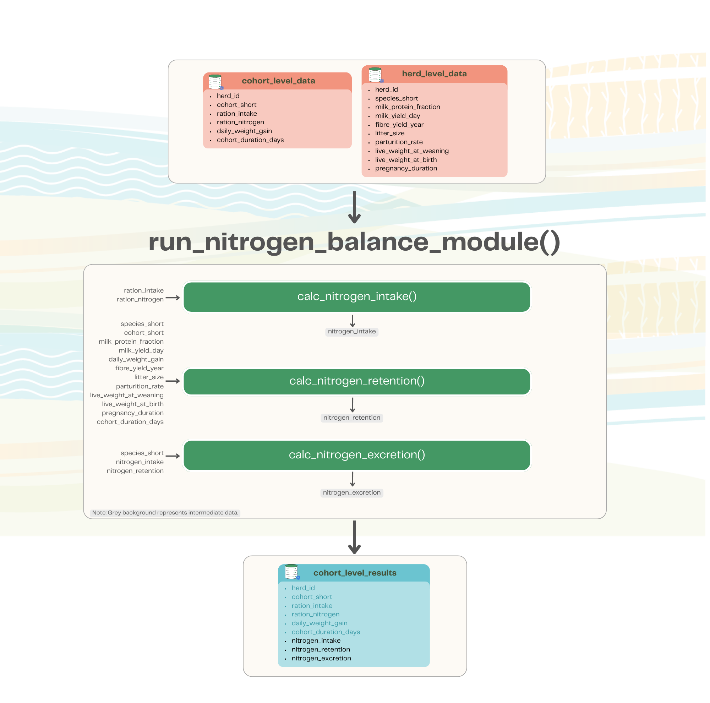
<div class="module-figure-hint"></div>

</details>

The following calculation sequence is applied:

1. Daily nitrogen intake is computed from `ration_intake` and `ration_nitrogen`
   using [`calc_nitrogen_intake()`](../reference/calc_nitrogen_intake.html).
2. Daily nitrogen retention (in body tissues and products such as growth,
   pregnancy, and milk) is computed using
    [`calc_nitrogen_retention()`](../reference/calc_nitrogen_retention.html).
3.  Daily nitrogen excretion is computed as intake minus retention using
    [`calc_nitrogen_excretion()`](../reference/calc_nitrogen_excretion.html).


# Manure Emissions Module

*See [`run_emissions_manure_module()`](../reference/run_emissions_manure_module.html) for full documentation.*

Computes cohort-level greenhouse gas emissions from manure management systems
(MMS) following the IPCC Tier 2 methodology, using volatile solids (VS), MMS
allocation fractions, and MMS-specific emission factors.


For each `herd_id`, the set of MMS identifiers must be consistent between the
`manure_management_system_fraction` and `manure_management_system_factors`
tables. The following calculation sequence is applied:

1. **Volatile solids (VS)** excretion is computed from feed ration nutritional
   parameters (digestibility, urinary energy, ash) using
<details open>
<summary><strong>Overview of the GLEAM manure emissions module with functions, input and output:</strong></summary>

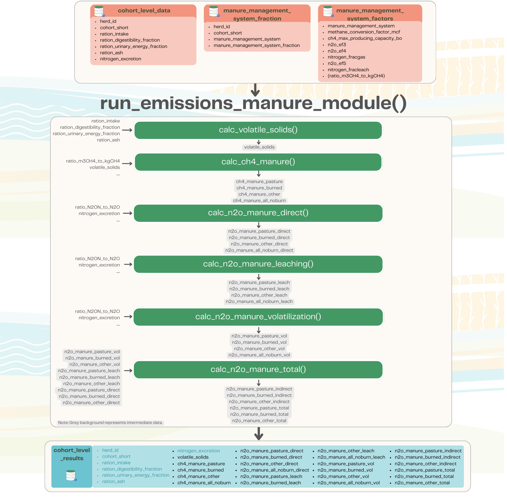
<div class="module-figure-hint"></div>

</details>

    [`calc_volatile_solids()`](../reference/calc_volatile_solids.html)
    (IPCC 2006/2019, Eq. 10.24).
2. **Methane (CH₄)** emissions from manure management are computed from VS and
   MMS-specific factors (MCF and B₀), reported by MMS group (pasture, burned,
   other) using [`calc_ch4_manure()`](../reference/calc_ch4_manure.html)
   (IPCC 2006/2019, Eq. 10.23).
3.  **Direct N₂O** emissions are computed from nitrogen excretion and
    MMS-specific EF3 values, reported by MMS group using
    [`calc_n2o_manure_direct()`](../reference/calc_n2o_manure_direct.html)
    (IPCC 2006/2019, Eq. 10.25).
4.  **Indirect N₂O** emissions are the sum of:
   - Volatilisation-driven N₂O from MMS-specific nitrogen losses (FracGas) and
     EF4 using [`calc_n2o_manure_volatilization()`](../reference/calc_n2o_manure_volatilization.html)
        (IPCC 2006/2019, Eq. 10.26–10.28).
   - Leaching/runoff-driven N₂O from MMS-specific nitrogen losses (FracLeach)
     and EF5 using [`calc_n2o_manure_leaching()`](../reference/calc_n2o_manure_leaching.html)
        (IPCC 2006/2019, Eq. 10.27–10.29).
5.  **Total N₂O** (direct + indirect) is summed by MMS group using
    [`calc_n2o_manure_total()`](../reference/calc_n2o_manure_total.html).


# Feed Production Emissions Module

*See [`run_emissions_ration_module()`](../reference/run_emissions_ration_module.html) for full documentation.*

Computes cohort-level average greenhouse gas emission factors from feed
production by weighting the emission factors of individual feed components by
diet composition. Returns diet-level average GHG emission factors by gas and
emission source for each cohort.

The module joins ration shares with feed emission factors by `feed_id` and
applies the following calculation sequence:

1. **Merge** ration shares with emission factors at the feed-component level.
2. **Compute feed-component contributions** (row-wise) for each emission source
   by multiplying the ration share of each feed component
   (`feed_ration_fraction`) by the corresponding emission factor:
   - CO₂ from fertilizer manufacture — [`calc_co2_ration_fertilizer()`](../reference/calc_co2_ration_fertilizer.html)
   - CO₂ from pesticide manufacture — [`calc_co2_ration_pesticides()`](../reference/calc_co2_ration_pesticides.html)
   - CO₂ from on-field crop activities — [`calc_co2_ration_crop_activities()`](../reference/calc_co2_ration_crop_activities.html)
   - CO₂ from land-use change (no peat) — [`calc_co2_ration_luc_nopeat()`](../reference/calc_co2_ration_luc_nopeat.html)
   - CO₂ from land-use change (peat) — [`calc_co2_ration_luc_peat()`](../reference/calc_co2_ration_luc_peat.html)
   - N₂O from fertilizer use — [`calc_n2o_ration_fertilizer()`](../reference/calc_n2o_ration_fertilizer.html)
   - N₂O from manure applied to soil — [`calc_n2o_ration_manure()`](../reference/calc_n2o_ration_manure.html)
   - N₂O from crop residues — [`calc_n2o_ration_crop_residues()`](../reference/calc_n2o_ration_crop_residues.html)
   - CH₄ from rice cultivation — [`calc_ch4_ration_rice()`](../reference/calc_ch4_ration_rice.html)
3. **Sum** component contributions within each cohort to obtain diet-level
   average emission factors (g gas/kg DM).


<details open>
<summary><strong>Overview of the GLEAM feed production emissions module with functions, input and output:</strong></summary>

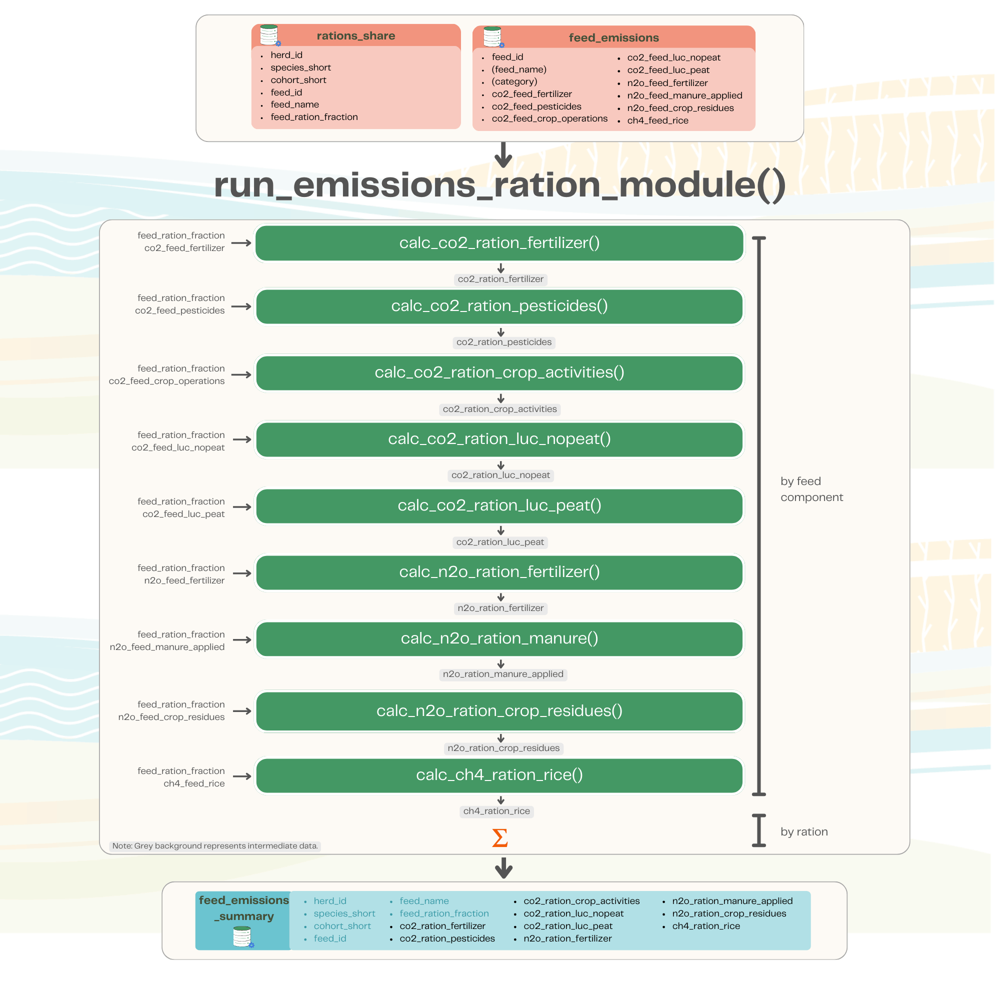
<div class="module-figure-hint"></div>

</details>

# Production Module

*See [`run_production_module()`](../reference/run_production_module.html) for full documentation.*

Computes cohort-level production outputs over the assessment period by
combining cohort-level herd structure inputs with herd-level production
parameters. The module returns milk, fibre, and meat outputs for each cohort.

<details open>
<summary><strong>Overview of the GLEAM production module with functions, input and output:</strong></summary>

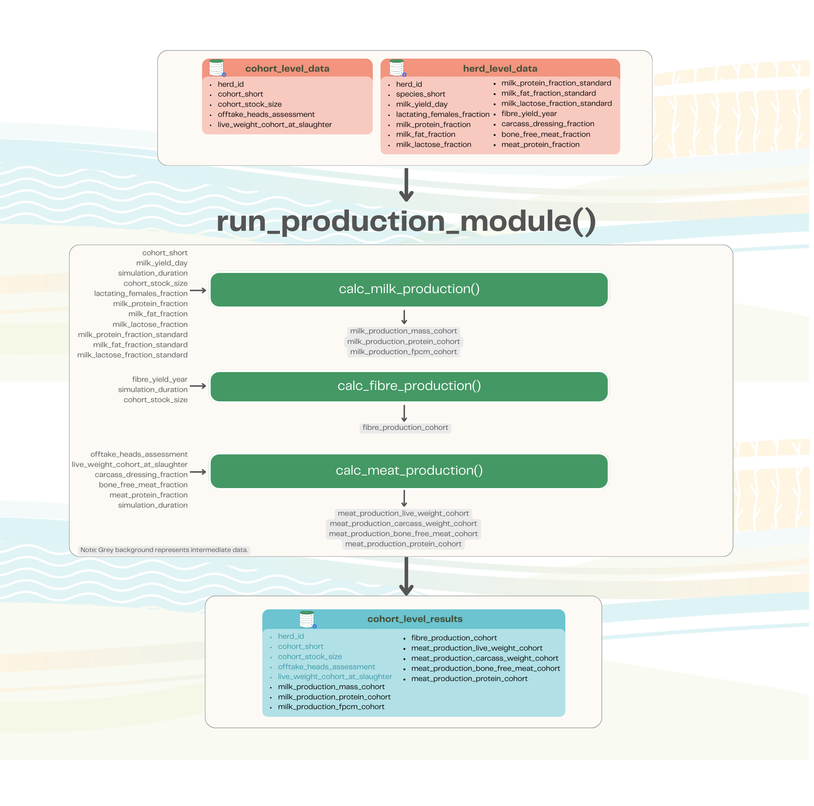
<div class="module-figure-hint"></div>

</details>

The following calculation sequence is applied:

1. Milk outputs (raw mass, protein, and fat-protein-corrected milk — FPCM) are
   computed using [`calc_milk_production()`](../reference/calc_milk_production.html).
2.  Fibre outputs (wool, cashmere, mohair) are computed using
    [`calc_fibre_production()`](../reference/calc_fibre_production.html).
3. Meat outputs (live weight, carcass weight, bone-free meat, and protein) are
   computed using [`calc_meat_production()`](../reference/calc_meat_production.html).


# Emission Allocation Module

*See [`run_allocation_module()`](../reference/run_allocation_module.html) for full documentation.*

Computes biophysical allocation shares for livestock commodities by calculating
cohort-level energy requirements for meat, milk, fibre, work, and eggs,
aggregating these terms to herd level, and assigning allocation shares to
emission sources.
The approach follows the IDF Global Carbon Footprint Standard for the dairy
sector, adapted for livestock systems in which emissions are apportioned among
multiple products according to their physiological energy requirements. This is
consistent with ISO 14044:2006 (Section 4.3.4.2, Step 2).
<details open>
<summary><strong>Overview of the GLEAM emissions allocation module with functions, input and output:</strong></summary>

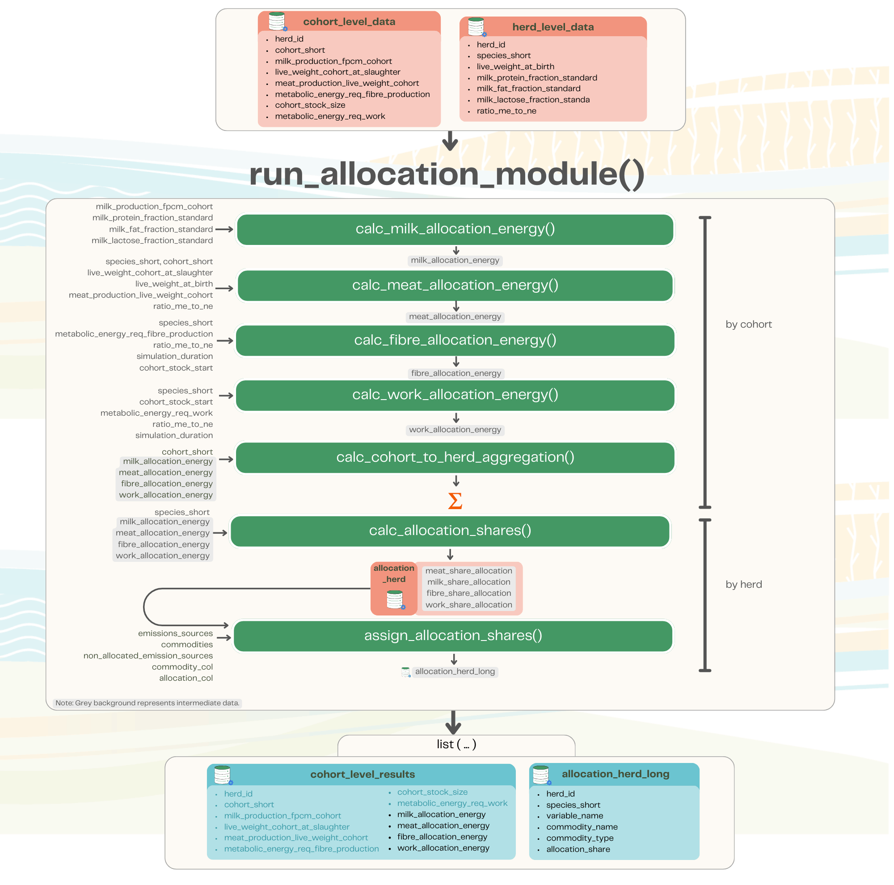
<div class="module-figure-hint"></div>

</details>


The pipeline consists of the following steps:

1. **Cohort-level energy allocation terms** are computed for each commodity:
   - Meat — [`calc_meat_allocation_energy()`](../reference/calc_meat_allocation_energy.html)
   - Milk — [`calc_milk_allocation_energy()`](../reference/calc_milk_allocation_energy.html)
   - Fibre — [`calc_fibre_allocation_energy()`](../reference/calc_fibre_allocation_energy.html)
   - Work (draught power) — [`calc_work_allocation_energy()`](../reference/calc_work_allocation_energy.html)
    -   Eggs — set to 0 (not yet implemented)
2.  **Cohort-level energy terms are aggregated to herd level** using
    [`calc_cohort_to_herd_aggregation()`](../reference/calc_cohort_to_herd_aggregation.html).
3.  **Herd-level allocation shares** are computed using
    [`calc_allocation_shares()`](../reference/calc_allocation_shares.html).
4. **Allocation shares are reshaped to long format** and assigned to emission
   sources using [`assign_allocation_shares()`](../reference/assign_allocation_shares.html).


# Aggregation and Reporting Module

*See [`run_aggregation_module()`](../reference/run_aggregation_module.html) for full documentation.*

This is the final step of the GLEAM pipeline. It generates final herd-level
results by aggregating key cohort-level outputs, scaling variables over the
assessment duration, allocating emissions to commodities, and converting CH₄
and N₂O emissions to CO₂-equivalents (CO₂eq) using selected 100-year Global
Warming Potential (GWP-100) factors.

<details open>
<summary><strong>Overview of the GLEAM aggregation module with functions, input and output:</strong></summary>

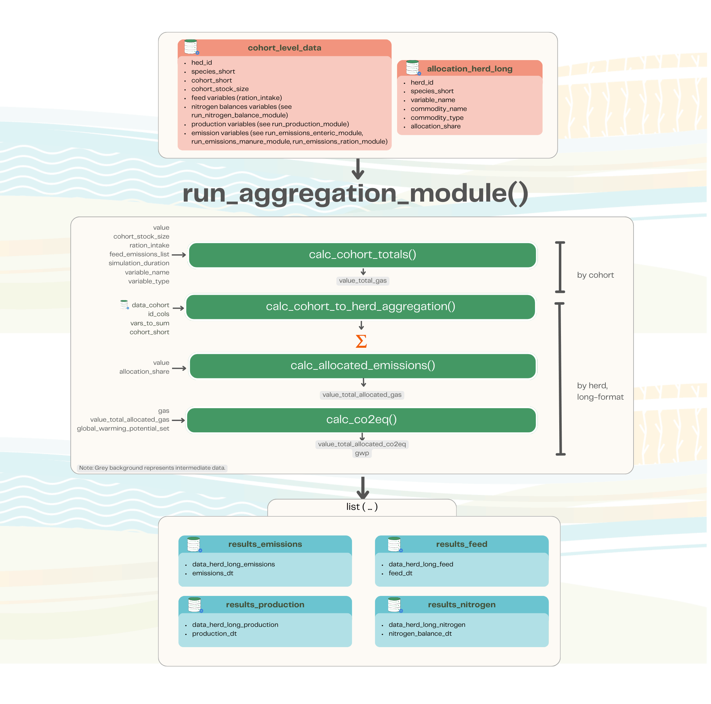
<div class="module-figure-hint"></div>

</details>

The following calculation sequence is applied:

1.  Cohort-level variables are reshaped from wide to long format.
2.  Variables are classified into `"Feed"`, `"NitrogenBalance"`,
    `"Production"`, and `"Emissions"`.
3.  Cohort totals are calculated using
   [`calc_cohort_totals()`](../reference/calc_cohort_totals.html). Production
   variables are retained as provided; emissions, feed, and nitrogen balance
   variables are scaled using cohort stock size and simulation duration.
4.  Cohort totals are aggregated to herd level using
    [`calc_cohort_to_herd_aggregation()`](../reference/calc_cohort_to_herd_aggregation.html).
5.  Herd-level emissions are merged with commodity allocation shares.
6.  Emissions are allocated to commodities using
    [`calc_allocated_emissions()`](../reference/calc_allocated_emissions.html).
7. Gas type (CH₄, N₂O, CO₂) is identified from the emission variable name.
8.  Allocated emissions are converted to CO₂eq using
   [`calc_co2eq()`](../reference/calc_co2eq.html) and the selected GWP-100
   option (AR4, AR5, or AR6).
9.  Final output tables are produced summarising herd-level results for
    emissions, feed, production, and nitrogen balance.
