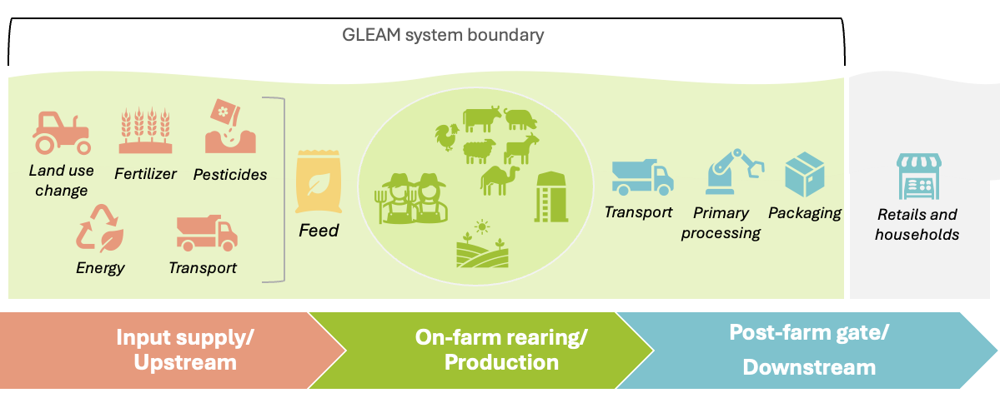
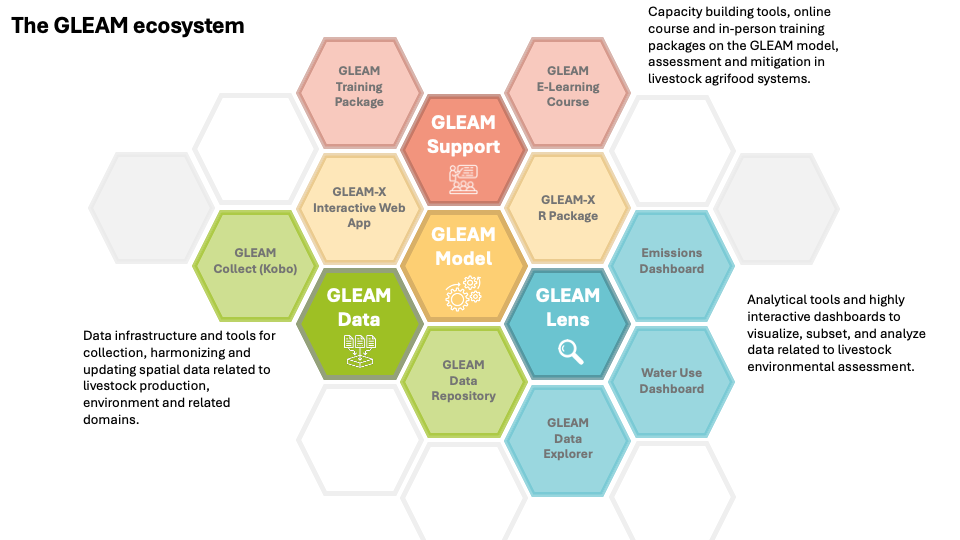
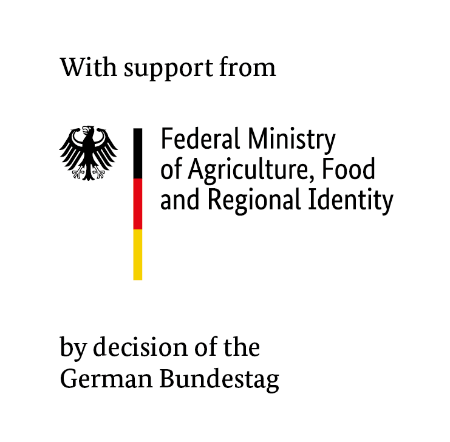

```{r setup, include = FALSE}
knitr::opts_chunk$set(
  collapse = TRUE,
  comment  = "#>",
  eval     = FALSE
)
```

# Introduction

The `gleam` R package implements the core computational engine of the Global
Livestock Environmental Assessment Model (GLEAM), developed by the Food and
Agriculture Organization of the United Nations (FAO). It provides a modular,
transparent, and reproducible framework for quantifying greenhouse gas (GHG)
emissions from livestock supply chains using a Life Cycle Assessment (LCA)
approach based on the IPCC Tier 2 methodology.

The package covers seven livestock species: cattle (CTL), buffalo (BFL),
camels (CML), sheep (SHP), goats (GTS), pigs (PGS), and chickens (CHK). It
estimates emissions from enteric fermentation, manure management, and feed
production, and allocates them to livestock commodities (meat, milk, fibre,
and work) using a biophysical energy-based allocation framework consistent
with ISO 14044, LEAP guidelines and the IDF Global Carbon Footprint Standard.

The package is part of the broader GLEAM ecosystem, which includes interactive
web applications, dashboards, data infrastructure, and capacity-building tools.
This vignette provides an overview of the R package specifically; a brief
description of the wider ecosystem is given in [The GLEAM Ecosystem](#the-gleam-ecosystem).

```{r, echo=FALSE, eval = TRUE, out.width="90%", fig.cap="Species currently covered in GLEAM"}

```

# Installation

Install the package from the FAO GitHub repository:

```{r installation}
# Install devtools if not already available
install.packages("devtools")

# Install the gleam package from GitHub
devtools::install_git("https://github.com/un-fao/GLEAM.git")
```

The package depends on `data.table` for all data manipulation. All input and
output datasets are `data.table` objects throughout the pipeline.


# Key Concepts

## Species codes {#species-codes}

Every function in the package identifies livestock species using standardized
short codes that appear as `species_short` in the data:

| Code | Species  |
|------|----------|
| CTL  | Cattle   |
| BFL  | Buffalo  |
| SHP  | Sheep    |
| GTS  | Goats    |
| CML  | Camels   |
| PGS  | Pigs     |
| CHK  | Chickens |

## Sex–age cohort codes {#cohort-codes}

Within each herd, animals are classified into six sex–age cohorts that define
their production stage:

| Code | Sex    | Age class  | Life stage definition                          |
|------|--------|------------|------------------------------------------------|
| FJ   | Female | Juvenile   | From birth to weaning                          |
| FS   | Female | Sub-adult  | From weaning to first parturition              |
| FA   | Female | Adult      | From first parturition onwards                 |
| MJ   | Male   | Juvenile   | From birth to weaning                          |
| MS   | Male   | Sub-adult  | From weaning to first breeding                 |
| MA   | Male   | Adult      | From first breeding onwards                    |

These cohort codes appear in the `cohort_short` column of all cohort-level
data tables and are required by nearly every function in the package.

## Cohort-level population data

If the cohort distribution is not supplied by the user, the GLEAM demographic
herd module generates population numbers for each cohort based on the
herd-level parameters and total population size.

## Assessment period

The assessment period (`cohort_short`) defines the time window over which emissions and
production are computed. It is specified in days (typically 365 for a standard
annual assessment). Per-head, per-day intermediate values are scaled to cohort
totals over the assessment period in the aggregation step. The assessment
period can also be used to represent different seasons with distinct variations
in input data (e.g., feed basket composition or nutritional quality).


# Quick Start

The following example loads the sample data shipped with the package and runs
the full pipeline:

```{r quick-start}
library(gleam)
library(data.table)

# ---- Load sample data from inst/extdata ----
path <- system.file("extdata/run_gleam_examples", package = "gleam")

cohort_dt      <- fread(file.path(path, "master_chrt_lvl_no_structure_data.csv"))
herd_dt        <- fread(file.path(path, "master_hrd_lvl_data.csv"))
rations_dt     <- fread(file.path(path, "feed_rations_share_chrt.csv"))
feed_params_dt <- fread(file.path(path, "feed_quality.csv"))
feed_emis_dt   <- fread(file.path(path, "feed_emission_factors.csv"))
mms_frac_dt    <- fread(file.path(path, "manure_management_system_fraction.csv"))
mms_fact_dt    <- fread(file.path(path, "manure_management_system_factors.csv"))

# ---- Run the full GLEAM pipeline ----
results <- run_gleam(
  has_herd_structure                = FALSE,
  cohort_level_data                 = cohort_dt,
  herd_level_data                   = herd_dt,
  feed_rations                      = rations_dt,
  feed_params                       = feed_params_dt,
  feed_emissions                    = feed_emis_dt,
  manure_management_system_fraction = mms_frac_dt,
  manure_management_system_factors  = mms_fact_dt,
  simulation_duration               = 365,
  global_warming_potential_set      = "AR6"
)

# ---- Inspect results ----
print(results$cohort_level_results)
print(results$allocation_long)
print(results$aggregation_results$results_emissions)
```

If you already have a pre-computed herd structure (population sizes and offtake
numbers), set `has_herd_structure = TRUE` and supply a cohort-level table that
includes the `cohort_stock_size` and `offtake_heads_assessment` columns. The
pipeline will skip the herd simulation step and proceed directly to the weight
calculations.


# Pipeline Overview

The `run_gleam()` function orchestrates the full modelling pipeline by calling
individual modules in sequence. Each module can also be run independently for
custom workflows. The pipeline consists of the following steps:

| # | Module | Function | Key outputs |
|---|--------|----------|-------------|
| 1 | Herd simulation (optional) | [`run_demographic_herd_module()`](../reference/run_demographic_herd_module.html) | Cohort sizes, offtake numbers, herd growth rate |
| 2 | Cohort weights | [`run_weights_module()`](../reference/run_weights_module.html) | Initial, average, and final live weights; daily weight gain |
| 3 | Ration nutritional content | [`run_ration_quality_module()`](../reference/run_ration_quality_module.html) | Diet gross energy, digestibility, nitrogen, ash |
| 4 | Metabolic energy requirements and ration intake | [`run_metabolic_energy_req_module()`](../reference/run_metabolic_energy_req_module.html) | Energy partitions (maintenance, growth, lactation, etc.); dry matter intake |
| 5 | Enteric emissions | [`run_emissions_enteric_module()`](../reference/run_emissions_enteric_module.html) | Enteric CH₄ emissions |
| 6 | Nitrogen balance | [`run_nitrogen_balance_module()`](../reference/run_nitrogen_balance_module.html) | Nitrogen intake, retention, and excretion |
| 7 | Manure emissions | [`run_emissions_manure_module()`](../reference/run_emissions_manure_module.html) | CH₄ and N₂O from manure management |
| 8 | Feed production emissions | [`run_emissions_ration_module()`](../reference/run_emissions_ration_module.html) | GHG from feed production |
| 9 | Production outputs | [`run_production_module()`](../reference/run_production_module.html) | Production of milk, meat, and fibre |
| 10 | Emission allocation | [`run_allocation_module()`](../reference/run_allocation_module.html) | Biophysical allocation shares and allocated emissions per commodity |
| 11 | Aggregation and reporting | [`run_aggregation_module()`](../reference/run_aggregation_module.html) | Herd-level aggregation of emissions and conversion to CO₂eq |

Each module validates its inputs before execution, checking for required
columns, valid value ranges, and consistency across data tables. This ensures
that errors are caught early and do not propagate silently through the
pipeline. A three-tier structure is implemented consistently throughout. Every public function calls its validator before any computation. Constants are centralized in `gleam_constants.R`.

```
run_*_module()          # orchestrator: validates, calls core functions, assembles output
    └─ core_model_*.R     # scientific functions: one exported function per quantity
         └─ validate_*.R  # input guards: called first in every function
```

<details open>
<summary><strong>Overview of the GLEAM pipeline wih the different modules:</strong></summary>

<div style="position:relative; overflow:visible; margin:1em 0;">
  
</div>

</details>

## Running individual modules

For custom workflows, research applications, or step-by-step debugging, each
module can be called independently. For example, to compute only metabolic
energy requirements:

```{r individual-module}
# Assumes cohort_level_data and herd_level_data have been prepared with
# weight and ration quality variables already merged in.
energy_results <- run_metabolic_energy_req_module(
  cohort_level_data = my_cohort_data,
  herd_level_data   = my_herd_data
)
```

An overview of all modules, their inputs and outputs is provided in the [Module Overview vignette](gleam-modules-overview.html).


## Using individual scientific functions

At the lowest level, all core computations are exposed as individual scientific
functions. These can be called directly for research or testing purposes. For
example, to compute maintenance energy requirements for a single cohort:

```{r individual-functions}
e_maint <- calc_metabolic_energy_req_maintenance(
  species_short              = "CTL",
  cohort_short               = "FA",
  live_weight_cohort_average = 450,
  lactating_females_fraction = 0.7,
  offtake_rate               = 0.15,
  age_first_parturition      = 1095
)
```


# Input Data

The `run_gleam()` pipeline requires several input data tables. Sample files for
all tables are provided in `inst/extdata/run_gleam_examples/` and can be loaded
with `data.table::fread()` as shown in the [Quick Start example](#quick-start).

## cohort_level_data

A `data.table` with one row per herd × cohort (six rows per herd).

| Column | Type | Description |
|--------|------|-------------|
| `herd_id` | Character | Unique herd identifier, repeated for each cohort |
| `species_short` | Character | Livestock species code (see [species codes](#species-codes)) |
| `cohort_short` | Character | Sex–age cohort code (see [cohort codes](#cohort-codes)) |
| `cohort_duration_days` | Numeric | Time each animal spends in the cohort (days) |
| `offtake_rate` | Numeric | Annual proportion of animals removed from the herd per cohort (fraction) |
| `death_rate` | Numeric | Annual death fraction per cohort (fraction); required when `has_herd_structure = FALSE` |
| `low_activity_fraction` | Numeric | Proportion of the assessment period with low-intensity movement (fraction) |
| `high_activity_fraction` | Numeric | Proportion of the assessment period with sustained locomotion (fraction) |

Additional columns are required when `has_herd_structure = TRUE`
(`cohort_stock_size`, `offtake_heads_assessment`). See `?run_gleam` for the
complete column specification.

## herd_level_data

A `data.table` with one row per herd.

Key columns include live weights (adult female/male, birth, weaning,
slaughter), reproductive parameters (parturition rate, litter size, pregnancy
duration), production parameters (milk yield, milk composition, fibre yield),
draught work parameters, and slaughter/dressing parameters. See `?run_gleam`
for the full list.

## feed_rations

A `data.table` with one row per herd × cohort × feed component.

| Column | Type | Description |
|--------|------|-------------|
| `herd_id` | Character | Unique herd identifier |
| `cohort_short` | Character | Cohort code |
| `feed_id` | Character | Unique feed component identifier |
| `feed_ration_fraction` | Numeric | Share of this feed in the total ration dry matter (fraction); must sum to 1 per herd × cohort |

## feed_params

A `data.table` with one row per feed component, providing nutritional
parameters: gross energy, digestible energy (ruminants and pigs), metabolizable
energy (ruminants, pigs, chickens), nitrogen content, urinary energy fraction,
and ash content. Joined to `feed_rations` by `feed_id`.

## feed_emissions

A `data.table` with one row per feed component, providing emission factors (g
gas/kg DM) for CO₂ from fertilizer manufacture, pesticide manufacture,
on-field crop activities, and land-use change (peat and non-peat); N₂O from
fertilizer use, manure applied to soil, and crop residues; and CH₄ from rice
cultivation.

## manure_management_system_fraction

A `data.table` with one row per herd × cohort × manure management system
(MMS), specifying the fraction of total manure handled by each system. The
names `mms_pasture` and `mms_burned` are reserved for manure deposited on
pasture and burned for fuel, respectively. Fractions must sum to 1 per
herd × cohort.

## manure_management_system_factors

A `data.table` with one row per MMS, providing emission factors and parameters:
methane conversion factor (MCF), maximum CH₄ producing capacity (B₀), direct
and indirect N₂O emission factors (EF3, EF4, EF5), and nitrogen volatilisation
and leaching fractions.


# Output Structure

`run_gleam()` returns a named list with four elements:

- **`cohort_level_results`**: A cohort-level `data.table` containing all
  original input columns plus every variable computed across the pipeline,
  expressed as per-head, per-day quantities. Calculated variables include
  cohort stock sizes and offtake numbers, live weights, ration quality
  metrics, energy requirements, dry matter intake, enteric CH₄, nitrogen
  balance, volatile solids, manure CH₄ and N₂O (by MMS group), feed
  production emission factors, production outputs (milk, meat, fibre), and
  allocation energies.

- **`herd_level_results`**: A herd-level `data.table` containing the
  herd-level input parameters plus, when `has_herd_structure = FALSE`, the
  annualized herd growth rate (`growth_rate_herd`).

- **`allocation_long`**: A herd-level `data.table` in long format with one
  row per herd × commodity × emission source, containing the biophysical
  allocation shares used to distribute herd-level emissions to commodities
  (Milk, Meat, Fibre, Work, Eggs, None).

- **`aggregation_results`**: A named list with four `data.table` elements:
  - `results_emissions`: herd-level GHG emissions scaled to the assessment
    period and expressed in kg gas and kg CO₂eq;
  - `results_feed`: herd-level feed intake;
  - `results_production`: herd-level production of milk, meat, and fibre;
  - `results_nitrogen`: herd-level nitrogen balance.

## Key output units

| Category | Units |
|----------|-------|
| Energy requirements | MJ/head/day |
| Dry matter intake | kg DM/head/day |
| Nitrogen balance | kg N/head/day |
| Enteric CH₄ | kg CH₄/head/day |
| Manure emissions | kg gas/head/day |
| Feed emission factors | g gas/kg DM |
| Production | kg/cohort/assessment period |
| Aggregated emissions | kg gas/herd/assessment period and kg CO₂eq |


# Methodological Background

## LCA approach and system boundary

```{r, echo=FALSE, eval = TRUE, out.width="100%", fig.cap="Livestock agrifood systems and the GLEAM system boundary"}

```

GLEAM applies a cradle-to-processing-point Life Cycle Assessment (LCA)
framework. The system boundary encompasses:

- **Upstream processes**: feed crop and pasture production, fertilizer and
  input production, and feed processing.
- **On-farm processes**: animal husbandry, enteric fermentation, manure
  management, and on-farm energy use.
- **Downstream processes**: primary processing, storage, and transport of
  livestock products.

> **Note**: The current R package implements the on-farm emission modules
> (metabolic energy requirements, enteric emissions, manure management
> emissions, production outputs, and biophysical allocation). Feed production
> emissions are computed using emission factors per feed component. Downstream
> processing modules are under development.

## IPCC Tier 2 energy partitioning

The package implements the IPCC Tier 2 methodology for estimating GHG
emissions from livestock. Energy requirements are partitioned into maintenance,
activity, growth, lactation, pregnancy, work, and fibre production components
using species-specific equations from the IPCC 2006 Guidelines and the 2019
Refinement. Total daily energy requirements are then used to estimate dry
matter intake, volatile solids excretion, and enteric methane emissions.

Energy requirements for CTL, BFL, SHP, and GTS are expressed as net energy
(NE); for CML, PGS, and CHK they are expressed as metabolizable energy (ME).

## Biophysical allocation

Environmental burdens are allocated to livestock co-products (meat, milk,
fibre, and work) using a biophysical approach based on the energy required to
produce each commodity. This follows the IDF Global Carbon Footprint Standard
(IDF, 2022) and is consistent with ISO 14044:2006 (Section 4.3.4.2, Step 2).

Emissions from manure deposited on pasture and manure burned as fuel are
assigned to the residual category "Other" (not allocated to any commodity), in
line with LCA cut-off rules and to avoid double-counting with upstream feed
production.

## Global warming potentials

CO₂-equivalent emissions are computed using GWP-100 factors from the selected
IPCC Assessment Report. The `global_warming_potential_set` argument accepts:

| Value | Report | CH₄ | N₂O |
|-------|--------|-----|-----|
| `"AR6"` | IPCC 6th Assessment (2021) | 27 | 273 |
| `"AR5_excluding_carbon_feedback"` | IPCC 5th Assessment, excl. feedbacks (2013) | 28 | 265 |
| `"AR5_including_carbon_feedback"` | IPCC 5th Assessment, incl. feedbacks (2013) | 34 | 298 |
| `"AR4"` | IPCC 4th Assessment (2007) | 25 | 298 |


# The GLEAM Ecosystem

The `gleam` R package is one component of the broader GLEAM ecosystem
developed by FAO. The ecosystem integrates data, models, analytical tools, and
capacity-building resources to support sustainable livestock system
transformation.

```{r, echo=FALSE, eval = TRUE, out.width="100%", fig.cap="The GLEAM model within the GLEAM ecosystem"}

```

- **GLEAM Model** (this R package): the analytical engine implementing the
  core equations and pipeline. Enables reproducible research, batch
  processing, and custom workflows.

- **GLEAM-X Interactive Web Application**: a user-friendly interface to the R
  package for scenario building, visualization, and results analysis.
  Designed for policymakers, analysts, and technical users.

- **GLEAM Data**: data infrastructure including GLEAM Collect (KoBoToolbox-
  based field surveys) and the GLEAM Data Repository for livestock parameters,
  feed resources, and emission factors.

- **GLEAM Lens**: interactive dashboards for exploring GLEAM results across
  species, production systems, and regions, including GHG emission and water
  use dashboards.

- **GLEAM Support**: training packages and e-learning courses on livestock
  environmental impact assessment and GLEAM methodology.

Further information on the GLEAM ecosystem and updates of its components can be found on the [FAO GLEAM website](https://www.fao.org/gleam/en/).

# History of GLEAM

GLEAM builds on nearly two decades of FAO work on assessing the environmental
impacts of livestock systems at global scale. Key milestones include:

- **2006**: Pre-GLEAM era of non-spatial global assessments.
- **2010–2013**: Launch of GLEAM v1 with spatially explicit LCA using
  2005 reference-year data.
- **2017**: Release of GLEAM v2 and the GLEAM-i interactive web tool.
- **2023**: Release of GLEAM v3 with 2015 reference-year data, based on the
  2019 IPCC Refinement, and the GLEAM Dashboard.
- **2024**: GLEAM-Water. The first global assessment of water use in livestock agri-food systems
- **2024–present**: GLEAM-X initiative delivering an open-source R package and interactive web application.

```{r, echo=FALSE, eval = TRUE, out.width="100%", fig.cap="The history of the GLEAM model with different versions and major releases"}
knitr::include_graphics("images/overview_GLEAM_TimeLine.png")
```


# Further Resources

## Package documentation

- **Function reference**: Full documentation for all exported functions is
  available via `?function_name` (e.g., `?run_gleam`) or the online reference
  manual.
- **Sample data**: Example datasets for all input tables are in
  `inst/extdata/run_gleam_examples/`.

## Methodological references
  - **IPCC. (2019).**  
  *2019 Refinement to the 2006 IPCC Guidelines for National Greenhouse Gas Inventories.*  
  Volume 4, Chapter 10: Emissions from Livestock and Manure Management.  
  https://www.ipcc-nggip.iges.or.jp/public/2019rf/index.html

- **IPCC. (2006).**  
  *2006 IPCC Guidelines for National Greenhouse Gas Inventories.*  
  Volume 4, Chapter 10: Emissions from Livestock and Manure Management.  
  https://www.ipcc-nggip.iges.or.jp/public/2006gl/index.html

- **IDF. (2022).**  
  *The IDF Global Carbon Footprint Standard for the Dairy Sector.*  
  Bulletin of the IDF No. 520/2022.  
  https://shop.fil-idf.org/products/the-idf-global-carbon-footprint-standard-for-the-dairy-sector

- **FAO LEAP.**  
  *Guidelines for livestock supply chains (large ruminants, small ruminants, poultry, pigs, feed).*  
  https://www.fao.org/partnerships/leap/en

  

## GLEAM publications

- **Gerber, P.J., Steinfeld, H., Henderson, B., Mottet, A., Opio, C., Dijkman, J., Falcucci, A., & Tempio, G. (2013).**  
  *Tackling climate change through livestock: A global assessment of emissions and mitigation opportunities.*  
  FAO, Rome.  
  https://www.fao.org/4/i3437e/i3437e04.pdf

- **FAO. (2023).**  
  *Pathways towards lower emissions — A global assessment of the greenhouse gas emissions and mitigation options from livestock agrifood systems.*  
  FAO, Rome.  
  DOI: https://doi.org/10.4060/cc9029en

- **Wisser, D., Grogan, D.S., Lanzoni, L., Tempio, G., Cinardi, G., Prusevich, A., & Glidden, S. (2024).**  
  *Water Use in Livestock Agri-Food Systems and Its Contribution to Local Water Scarcity: A Spatially Distributed Global Analysis.*  *Water*, 16(12), 1681.  
  https://doi.org/10.3390/w16121681
  

# Resource partner

The development of the GLEAM ecosystem was supported by the German Federal Ministry of
Food, Agriculture, and Regional Identity [BMELH](https://www.bmleh.de/EN/Home/home_node.html)

```{r, echo=FALSE, eval = TRUE, out.width="30%", fig.cap=""}

```

---
