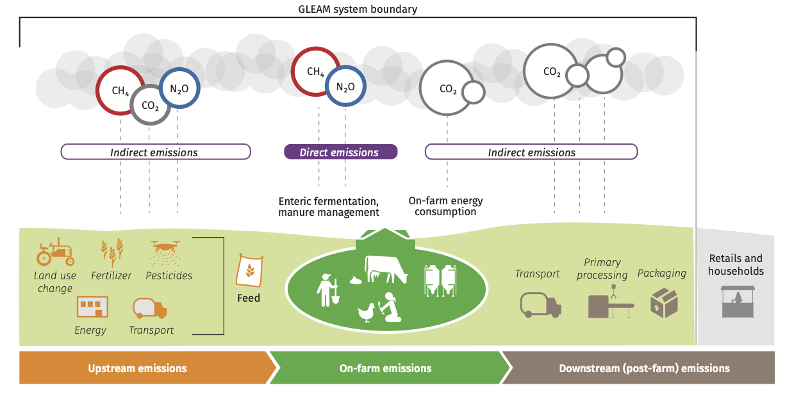

```{r, include = FALSE}
knitr::opts_chunk$set(
  collapse = TRUE,
  comment = "#>"
)
```
# What is GLEAM?

GLEAM provides tools for analyzing environmental data.
```{r gleam-overview, echo=FALSE, out.width="70%", fig.align="center", fig.cap="Overview of GLEAM framework"}

```

## Key Features

- Feature 1
- Feature 2
```

## File Structure
```
yourpackage/
├── vignettes/
│   ├── images/
│   │   ├── gleamhistory.png
│   │   └── otherimage.png
│   └── introduction.Rmd
```{r setup}
#library(gleam)
#knitr::include_graphics("images/gleamLCA.png", out.width =%100%%)


